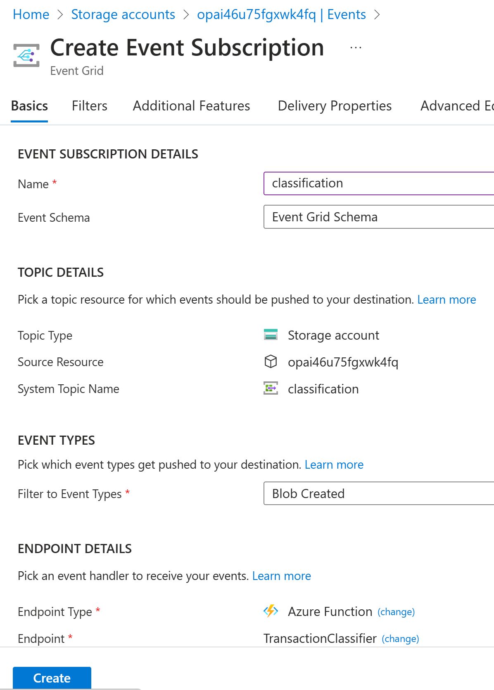

# Module 1: Lab - Transaction Classification Application

In this lab, you will create a transaction classification application that uses the Azure OpenAI API and other Azure services to classify a public dataset of transactions into a number of categories that we have predefined. These approaches should be replicable to any multiclass classificaiton use case where we are trying to fit transactional data into predefined categories, and by the end of running through this you should have an approach for dealing with unlabelled datasets.

## Installation

This module requires creation of following Azure resources
  1. An Azure Storage Account and two containers: 
    1. "classification" - for the transaction file
    2. "output" - for the results
  2. An Azure Function App Resource
  3. An Event Grid Subscription to the Azure Function App Resource from the Azure Storage Account for "Blob Created" events
  
  * The first two listed resources are created by running the Github Actions workflow file [module1-infra-worflow.yaml](../../../.github/workflows/module1-infra-workflow.yaml) which executes [module2-infra.bicep](../../../tools/deploy/Module1/infra/module1-infra.bicep) Bicep template. To trigger this workflow manually:
    1. click on the `Actions` tab.
    2. Select `.github/workflows/module2-infra-worflow.yaml`.
    3. Click on the `Run workflow` button

* Deploy the Azure Function App code using Github Actions workflow file [module2-code-workflow.yaml](../../../.github/workflows/module1-code-workflow.yaml) as follows:
  1. In Azure portal, navigate to the Function App that was deployed in the last step.
  2. Click **Get publish profile** and download **.PublishSettings** file.
  3. Open the **.PublishSettings** file and copy the XML content.
  4. Paste the XML content to your GitHub Repository > Settings > Secrets > Add a new secret > **AZURE_FUNCTIONAPP_PUBLISH_PROFILE**
  5. Trigger this workflow manually:
    * click on the `Actions` tab.
    * Select `.github/workflows/module2-code-worflow.yaml`.
    * Click on the `Run workflow` button

* Configure following **Application Settings** for the Azure Function by going to your `function app > Configuration > Application Settings`:
  1. OPENAI_API_BASE - Azure OpenAI API Endpoint URL (e.g. https://openai-demo-ahmedbham.openai.azure.com/)
  2. OPENAI_API_KEY - Azure OpenAI API Key
  3. OPENAI_API_MODEL - "text-davinci-003" (set it equal to the `model name` you provided when deploying the `text-davinci-003` **model** in Azure OpenAI Studio)

* Create an `Event Grid Subscription` to the Azure Function App Resource from the Azure Storage Account for "Blob Created" events in Azure portal:
  1. Navigate to your `storage account > Events > + Event Subscription`
  2. Set `Event Schema` to `Event Grid Schema``
  3. Set `System Topic Name` to `classification`
  4. Select only `Blob Created` event type
  5. Select`Function App` as the `Endpoint Type`
  6. Set `Endpoint`value by selecting the correct `Subscription`, `Resource Group`, `Function App`, `Slot`, and `Function` from the dropdowns
  7. Click `Create` to create the subscription

* Open the sample transaction file [25000_spend_dataset_current_25.csv](../../../tools/deploy/Module1/data/25000_spend_dataset_current_25.csv) and notice that the **classification** column is empty. This is the column that will be populated by the Azure Function by calling Azure OpenAI API.   	
* Upload this file to the **classification** blob container: `portal > storage account > containers > classification > upload`
* After few seconds, download the updated file from the **output** blob container `portal > storage account > containers > output > download`
* Open the file and notice the **classification** column is populated with the predicted category for each transaction.