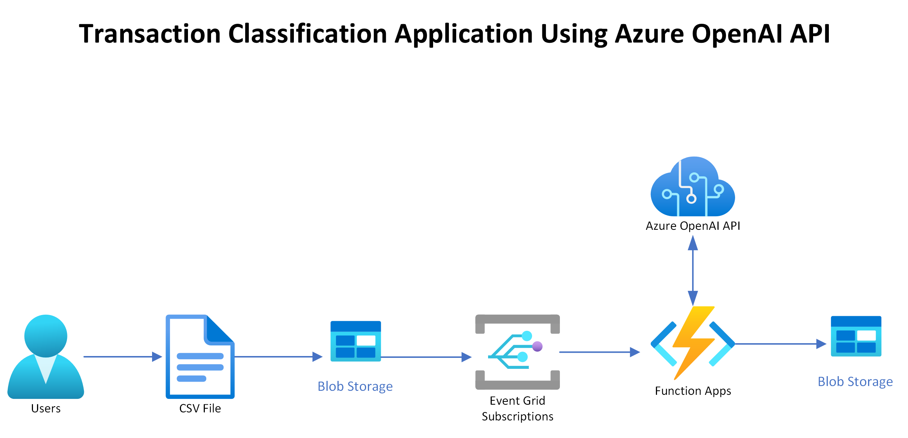

## Module 2 - Transaction Classification Application
This is a tutorial project that demonstrates how to integrate Azure OpenAI API with Azure services to build intelligent applications. Specifically, it shows how to classify transaction records using OpenAI's GPT-3 language model and Azure Storage, Azure Event Grid and Azure Function services.

The intent is to classify a public dataset of transactions into a number of categories that we have predefined. These approaches should be replicable to any multiclass classificaiton use case where we are trying to fit transactional data into predefined categories, and by the end of running through this you should have an approach for dealing with unlabelled datasets.

## Diagram



## Azure Function Logic

The Azure Function logic is implemented in [TransactionClassifier.cs](../../../tools/deploy/module2/TransactionClassifier/TransactionClassifier.cs) file. The logic is as follows:

### Prompt Engineering

A prompt is a string of text that is used to guide the language model to generate a response. In this case, we are using the following prompt to guide the language model to classify the transaction records:

```csharp
"You are a data expert working for the National Library of Scotland.
You are analysing all transactions over �25,000 in value and classifying them into one of five categories.
The five categories are Building Improvement, Literature & Archive, Utility Bills, Professional Services and Software/IT.
If you can't tell what it is, say Could not classify

Transaction:

Supplier: SUPPLIER_NAME
Description: DESCRIPTION_TEXT
Value: TRANSACTION_VALUE

The classification is:"
```

When the function is triggered when a csv file is uploaded to the blob storage, it will replace the `SUPPLIER_NAME`, `DESCRIPTION_TEXT` and `TRANSACTION_VALUE` placeholders with the actual values from the transaction records in that file.

### Classifying Transactions

The function will then call the Azure OpenAI API to classify the transaction record. The function will then parse the response from the API and extract the classification. Finally, the function will update the transaction record in an output csv file, and upload it to a blob container.

