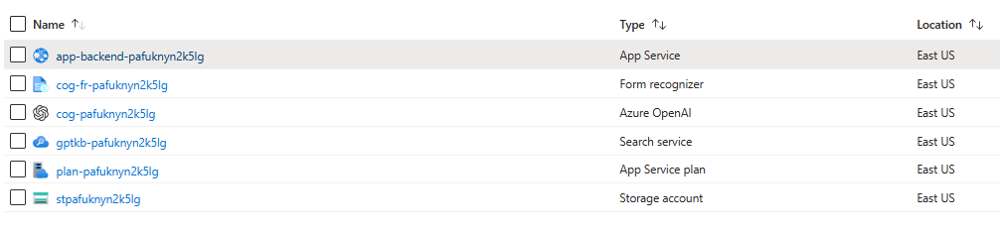

# Azure OpenAI and Cognitive Search

This sample demonstrates a few approaches for creating ChatGPT-like experiences over your own data using the Retrieval Augmented Generation pattern. It uses Azure OpenAI Service to access the ChatGPT model (gpt-35-turbo), and Azure Cognitive Search for data indexing and retrieval.

In this sample application we use a fictitious company called Contoso Electronics, and the experience allows its employees to ask questions about the benefits, internal policies, as well as job descriptions and roles.

## Features

* Chat and Q&A interfaces
* Explores various options to help users evaluate the trustworthiness of responses with citations, tracking of source content, etc.
* Shows possible approaches for data preparation, prompt construction, and orchestration of interaction between model (ChatGPT) and retriever (Cognitive Search)
* Settings directly in the UX to tweak the behavior and experiment with options

## Workflow

In this exercise, we deploy following resources in a single resource group. 

## How this works

The application has mainly three parts:

1. Prep-docs
2. Front-end
3. Back-end

### Prep-docs

As part of the deployment, we will upload the documents in the `/data` folder to the storage account and split the documents into individual pages. Basically, in the prep-doc step, we will process the PDF files, extract text and tables, split the content into sections (1000 characters), and upload the sections to an Azure search index for searching and retrieval.

### Front-end

Node.js and TypeScript are the main tools used for building the frontend web application. The main methods being used in the frontend application to communicate with a backend API for question-asking and chat-like conversations are:

- `askApi`: Takes an AskRequest object, sends a POST request to the `/ask` endpoint, and returns an AskResponse object. It throws an error if the response is not OK.
- `chatApi`: Takes a ChatRequest object, sends a POST request to the `/chat` endpoint, and returns an AskResponse object. It throws an error if the response is not OK.
- `getCitationFilePath`: Takes a citation string and returns the file path by concatenating `/content/` with the citation.

### Back-end

The back-end is a python flask application that hosts the `/ask` and `/chat` endpoints. The back-end establishes a connection to the Azure OpenAI resource to send a question to an OpenAI agent and retrieve the answer. The major functionalities discussed in this exercise are chat features and question-answer features. For the QA and chat, the following approaches are experimented within this Lab:
#### Ask Approaches:
> Note, most applications will use a single one of these patterns or some derivative. Several were included in this exercise to allow exploration of the different approaches. 

* **_ReadDecomposeAsk_** - This approach breaks down a given question into smaller tasks and searches for relevant information to answer the question. It uses a series of search and lookup actions, along with an AI agent, to find the answer. The agent iteratively refines the search, examines the search results, and performs lookups as needed. It uses the ReAct agent to perform these actions.

* **_ReadRetrieveReadApproach_** - This approach first reads the question and then retrieves relevant documents from a document store. After that, the AI agent reads these documents to find the answer. This approach is particularly suitable when there's a need to search through large document collections and extract relevant information to answer the question.

* **_RetrieveThenReadApproach_** - This approach retrieves relevant documents first, then reads the documents to answer the question. Unlike the ReadRetrieveReadApproach, which reads the question first, this approach starts with retrieval, followed by reading the retrieved documents to find the answer. This can be useful when the retrieval process is more important or computationally expensive than understanding the question.

These three approaches work together by providing different ways to tackle question-answering tasks based on the specific requirements of the task or the dataset being used. While they follow different methodologies, they all focus on retrieving relevant information and using OpenAI agents to process that information to generate a suitable answer. In this lab, you could choose the most appropriate approach for a specific question or dataset to improve the overall performance and efficiency of the question-answering system in the developer settings. 

#### Chat Approaches:
* **_ChatReadRetrieveRead_** - This is an implementation of an information retrieval and question-answering approach using Azure Cognitive Search and the OpenAI API. The class has a specific structure and methods to perform the following steps:

1. Generate an optimized keyword search query based on the chat history and the last question asked by the user.
2. Retrieve relevant documents from the search index using the generated query.
3. Generate a contextual and content-specific answer using the search results and chat history.

            
            
        
