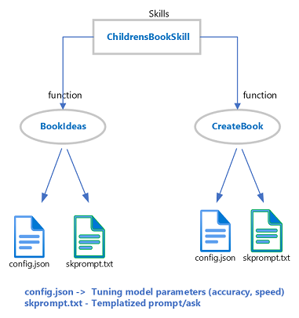
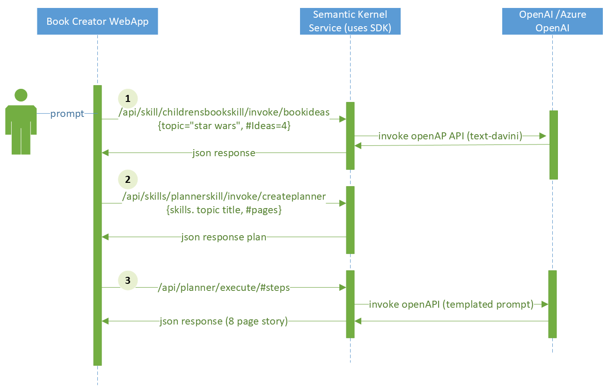

## Module 3: Book Creator application detailed flow

The following diagrams illustrates how skills/functions are defined and the interactions of the Book creator Client app and the Semantic Kernel API service exposed via the dotnet http endpoint.

### How are semantic skills defined?

  

### Sequence diagram - Book creator -> SK Service

The Semantic Kernel function API exposes 3 POST endpoints

- /skills/{skillName}/invoke/{functionName}
- /planner/createPlan
- /planner/execute/{maxSteps}

  

1. The childrensBookSkill is a predefined skill that with a templated prompt that can be found in the samples/skills folder, a skill may have one to many sub-skills or functions.
2. The planner skill is also a specialized skill that can leverage additional skills, embeddings and connectors.
3. The planner execute API uses the templated values of the previous steps from the planner to fulfill the user's Ask.
