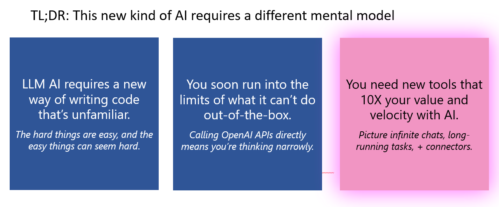
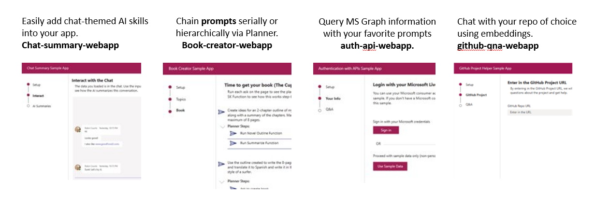

## Module 3 - Semantic Kernel

## What is Semantic Kernel?

Semantic Kernel is an Open source, Lightweight SDK that allows you to easily integrate Large Language Models (LLMs) like ChatGPT into your applications.

SK provides the developer with controls over AI LLM constructs such as prompts, embeddings and allows you to provide rich context to your application specific use cases that you would not have by just using OpenAI/Azure OpenAI APIs.

## Why is Semantic Kernel needed?

## Semantic Kernel - Use Cases

## Semantic Kernel - Pipeline

## Semantic Kernel - building blocks

- Planner - The planner is responsible for fulfilling a specific ASK, the planner has access to a pre-defined library of pre-made skills and can also call upon memories to best situate the ASK's context and connectors to call APIs and to leverage other external capabilities if needed.

- Memories – Also referred to as Embeddings and provides ability to provide specific context to an ASK or Prompt.

- Skills – Domain expertise exposed as a function, an ASK may use one or many skills/functions to accomplish a goal.

- Connectors – Ability to integrate with external, realtime APIs to enrich the response or perform an action.

