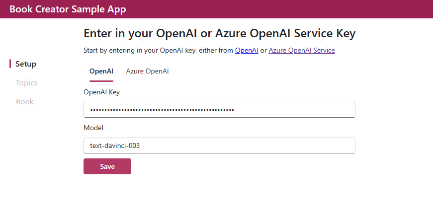
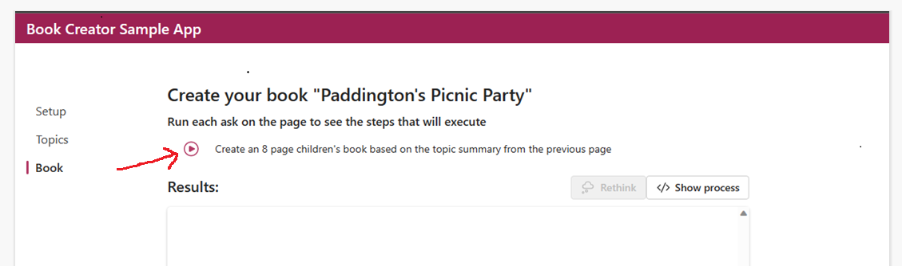

# Module 3: Lab - Book Creator application
 
 The Book creator sample application shows how `planner`, `skills` and `memories` are used to enrich content for a specific use case and allows you to enter in a children's book topic. Then the `Planner` creates a plan for the functions (skills) to run based on the Ask. You can see the execution plan along with the results. The `Writer` Skill functions are chained together based on the user ask.

Requirements:

- You will need an Open AI API Key or Azure Open AI service key to get started.
- [Azure Functions Core Tools]([https://learn.microsoft.com/en-us/azure/azure-functions/functions-run-local?tabs=v4%2Cwindows%2Ccsharp%2Cportal%2Cbash) are required to run the kernel as a local web service, this service is used by the sample web app.
- [.NET 6](https://dotnet.microsoft.com/en-us/download/dotnet/6.0). If you have .NET 7 installed, Azure Function Tools will still require .NET 6, so we suggest installing both.
- [Yarn](https://yarnpkg.com/getting-started/install) is used for installing web apps' dependencies.


## Running the Book Creator sample app

**Note**: to run the sample in VS Code Desktop using Dev Containers from Github Codespaces:
  Click hamburger menu on the left side of the VS Code window in Codespaces and select **Open in VS Code Desktop**

1. Clone the `semantic kernel` repo

   ```bash
   git clone https://github.com/microsoft/semantic-kernel.git
   ```

2. Start the `KernelHttpServer`. This is the backend API server used by the front end React app and is the intermediary between the front end client application and AzureOpenAI

   ```bash 
   cd semantic-kernel/samples/dotnet/KernelHttpServer
   ```

3. **Run**

   ```bash
   func start --csharp
   ```

   This will run the service API locally at `http://localhost:7071`.


   `cd semantic-kernel/samples/dotnet/KernelHttpServer`

4. In another terminal window, start the `BookCreator` web application

   ```bash
   cd semantic-kernel/samples/apps/book-creator-webapp-react/
   ```

5. Rename the `semantic-kernel/samples/apps/book-creator-webapp-react/.env.example` file to `semantic-kernel/samples/apps/book-creator-webapp-react/.env`.

6. Start the book creator app by running the following commands

   ```bash
   yarn install
   yarn start
   ```

7. A browser will automatically open, otherwise you can navigate to `http://localhost:3000` to access the application.

8. On the application main page, enter your AzureOpenAI key and also a value for the model ID as shown below, you may use the default **text-davinci-003** and click **Save** button

   

9. Follow the application prompts to enter a book idea and click **get Ideas** button to see some sample suggestions.

10. Select an idea option and click on the **create book** button to see the newly created book. Note: you need to additionally click on the play button as shown below on the next screen to get the book contents.

    
